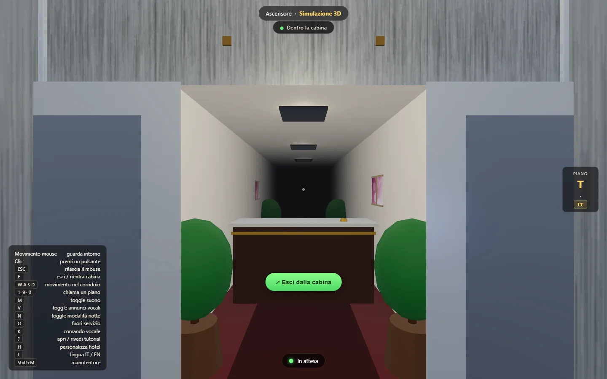
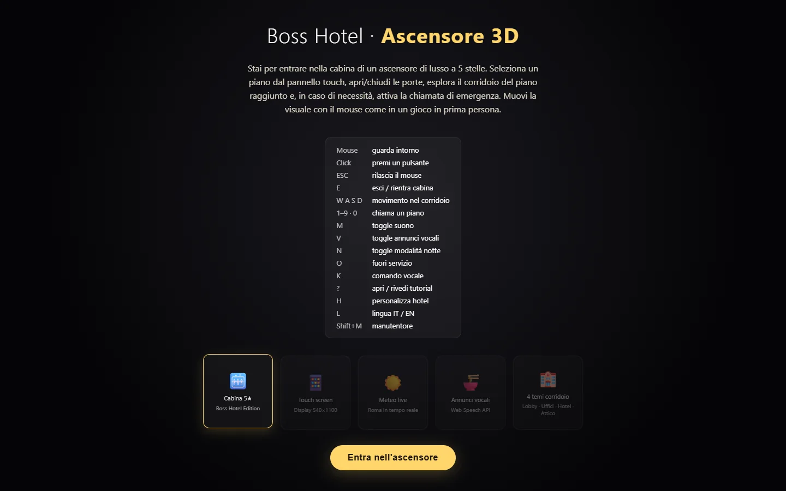
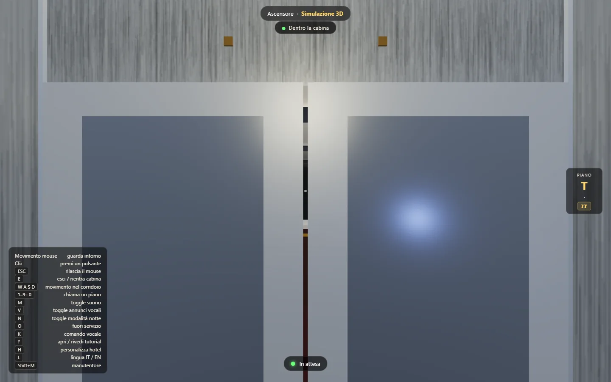
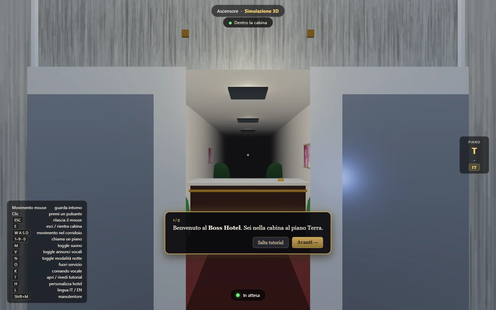
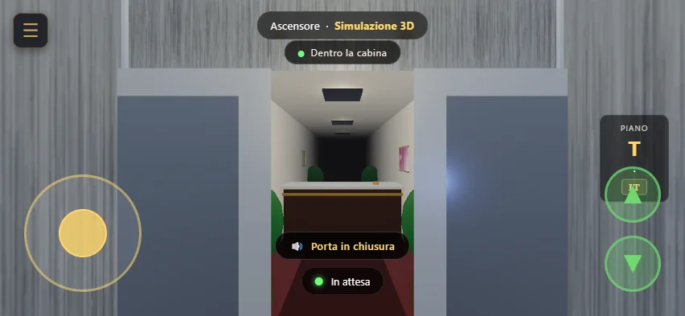
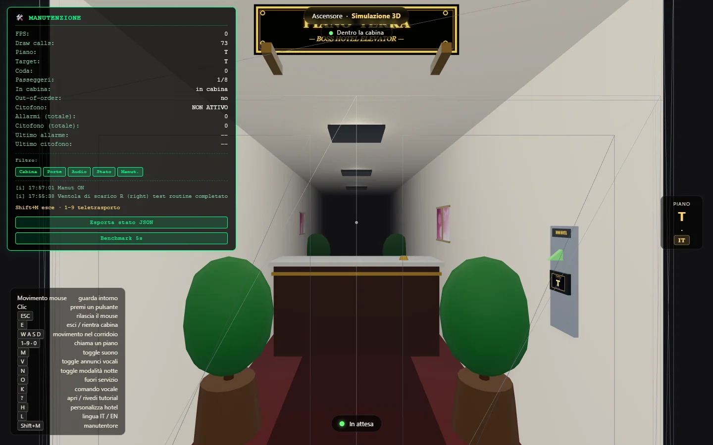

# BOSS HOTEL — Simulatore Ascensore 3D

[](https://threejs.org) []() [](./LICENSE) [](./tests.html) []() []() []() []() [](https://amedeo82.github.io/3d-elevator-simulations/)

> Un simulatore 3D in prima persona dell'interno di un ascensore di lusso, in
> **un singolo file HTML** di ~507 KB. Nessuna build, nessun bundler, nessuna
> dipendenza npm: si apre e funziona.

## 🚀 Provalo subito

[](https://amedeo82.github.io/3d-elevator-simulations/)

### **[https://amedeo82.github.io/3d-elevator-simulations/](https://amedeo82.github.io/3d-elevator-simulations/)**

Simulazione completa nel browser, senza installazione né registrazione.
Serve un browser con WebGL (Chrome, Edge, Firefox, Safari).

**Per giocare in locale**, senza toccare nulla: scarica `elevator.html` e
aprilo con un server statico.

```bash
python3 -m http.server 8000    # poi apri http://localhost:8000
```

## 📋 Indice

| Sezione | Cosa trovi |
|---|---|
| [Panoramica](#-panoramica) | Cosa fa il simulatore, in breve |
| [Galleria](#-galleria) | Screenshot desktop e mobile |
| [Funzionalità](#-funzionalità) | Le 32 aree funzionali, in sintesi |
| [Comandi](#-comandi) | Mouse, tastiera, touch |
| [Stack tecnico](#-stack-tecnico) | Cosa c'è sotto il cofano |
| [Documentazione](#-documentazione) | Tutti i documenti di progetto |
| [Contribuire](#-contribuire) | Come partecipare |
| [License](#-license) | MIT |

## 🎯 Panoramica

**BOSS HOTEL Elevator 3D** è un simulatore in prima persona dell'interno di
un ascensore di lusso. L'utente può:

- Muoversi con la visuale come in un gioco FPS (mouse-look con pointer lock)
- Interagire con una **pulsantiera digitale moderna** (display touch) per
  selezionare il piano
- Aprire e chiudere le **porte scorrevoli** con comportamento ADA-compliant
- **Uscire dalla cabina** ed esplorare il corridoio del piano raggiunto
- Sperimentare **4 temi di corridoio** in base al piano (lobby, uffici, camere
  hotel, attico)
- Ricevere **annunci vocali** in italiano o inglese all'arrivo al piano
- Vedere **meteo casuale**, **orologio in tempo reale** e **mappa
  dell'edificio** sul display
- Attivare l'**allarme di emergenza** o il **citofono EN 81-28**, distinti
- Personalizzare l'hotel (nome, tema, piani) con 4 preset pronti

Il tutto in **un singolo file HTML** di ~507 KB (~12.000 righe), deployato
staticamente, senza dipendenze npm in produzione.

## 📸 Galleria

| Schermata iniziale | Corridoio del piano | Pannello touch |
|---|---|---|
|  |  |  |
| **Welcome interattivo** con riepilogo comandi e personalizzazione hotel | **Ogni piano ha il suo tema**: lobby, uffici, camere hotel, attico | **Display touch** con 3-layer caching e indicatore passo-passo |

| Mobile (iPhone, landscape) | Modalità manutentore | Personalizzazione hotel |
|---|---|---|
|  |  |  |
| **Touch nativo**: joystick virtuale, ▲▼, menu `☰`. Nessun pointer lock | **Ispezione**: wireframe, teletrasporto, benchmark, log | **4 preset** di hotel modificabili, salvati in locale |

## ✨ Funzionalità

32 aree funzionali, dalle texture procedurali del marmo agli annunci vocali.
Il catalogo completo, con i tasti per ognuna, è in
**[`docs/FEATURES.md`](docs/FEATURES.md)**.

| Area | In breve |
|---|---|
| 🛗 **Cabina** | Acciaio spazzolato, marmo, specchio riflettente, alluminio, LED, telecamera |
| 📱 **Pulsantiera** | Display touch canvas + 4 tasti fisici, indicatore direzione passo-passo |
| 🚪 **Porte** | Scorrevoli con sensore IR, chiusura automatica differenziata per piano (ADA) |
| 🚶 **Corridoio** | 4 temi per piano, arredi procedurali, pulsantiera di chiamata ▲▼ esterna |
| 🗣️ **Vocali** | TTS IT/EN via Web Speech API, annunci di arrivo, allarme, porte |
| 🎵 **Audio** | Effetti sintetizzati (Web Audio) + musica contestuale per ambiente |
| 🌤️ **Meteo** | Casuale, icone dinamiche sul display, mappa dell'edificio |
| 🚨 **Emergenza** | Allarme (luci rosse, sirena) e citofono EN 81-28 come sistemi distinti |
| 🏨 **Personalizzazione** | `HOTEL_CONFIG` con 4 preset, salvataggio locale |
| 📱 **Mobile** | Touch controls, menu hamburger, separazione architetturale desktop/mobile |
| 🛠️ **Manutenzione** | Wireframe, teletrasporto, benchmark 5s, log eventi, export JSON |
| 🧪 **Test** | 305 test automatici in browser, eseguiti anche in CI |

## 🕹️ Comandi

Riepilogo; la tabella completa è in **[`docs/CONTROLS.md`](docs/CONTROLS.md)**.

| Azione | Desktop | Mobile |
|---|---|---|
| Ruota la visuale | Mouse | Trascina il dito |
| Movimento nel corridoio | `W` `A` `S` `D` | Joystick virtuale |
| Chiama un piano | `1`–`9` `0` | Pulsanti `▲` `▼` |
| Esci / rientra cabina | `E` | Tap sul badge HUD |
| Azioni varie | `M` `V` `N` `O` `K` `?` `H` `L` `Shift+M` | Menu `☰` |

## 🛠️ Stack tecnico

- **Three.js r160** (via CDN con importmap)
- **WebGL** per il rendering 3D
- **Canvas 2D API** per le texture dinamiche (display touch, pannello pubblicitario, cartelli)
- **Web Audio API** per effetti sonori sintetizzati (beep, chime, allarme)
- **Web Speech API** per gli annunci vocali TTS
- **Pointer Lock API** per il mouse-look FPS
- **HTML5 + CSS3** per l'HUD overlay

**Nessuna build step, nessun bundler, nessuna dipendenza npm.** È un singolo
file HTML statico.

## 📚 Documentazione

Guida allo sviluppo e al deploy:

| File | Contenuto |
|---|---|
| [`docs/FEATURES.md`](docs/FEATURES.md) | Catalogo completo delle 32 aree funzionali |
| [`docs/CONTROLS.md`](docs/CONTROLS.md) | Comandi mouse, tastiera e touch |
| [`docs/DEVELOPMENT.md`](docs/DEVELOPMENT.md) | Struttura del progetto, sviluppo locale, test, deploy |
| [`docs/ROADMAP.md`](docs/ROADMAP.md) | Storico release, Polish Pack, backlog residuo |
| [`ARCHITECTURE.md`](ARCHITECTURE.md) | Diagrammi architetturali e flussi dati |
| [`CHANGELOG.md`](CHANGELOG.md) | Storico commit auto-generato da `git log` |

Documenti di progetto:

| File | Contenuto |
|---|---|
| [`AGENTS.md`](AGENTS.md) | Regole per gli agenti, 34 contratti D-key, layout del codice ad ancore |
| [`CONTRIBUTING.md`](CONTRIBUTING.md) | Guida contributor, workflow PR, code style |
| [`STATE.md`](STATE.md) | Audit completo dello `state` globale |
| [`STRINGS_REFERENCE.md`](STRINGS_REFERENCE.md) | Mappatura i18n IT/EN |
| [`ROADMAP_POST_V7.md`](ROADMAP_POST_V7.md) | Backlog futuro aperto alla community |

Documenti di community:

| File | Contenuto |
|---|---|
| [`SECURITY.md`](SECURITY.md) | Politica di sicurezza (responsible disclosure) |
| [`CODE_OF_CONDUCT.md`](CODE_OF_CONDUCT.md) | Standard community (Contributor Covenant v2.1) |
| [`SUPPORT.md`](SUPPORT.md) | Dove chiedere aiuto / segnalare bug |

## 🤝 Contribuire

Il progetto è open source (MIT). La guida completa, con workflow e convenzioni,
è in [`CONTRIBUTING.md`](CONTRIBUTING.md).

In sintesi:

1. Fai una fork
2. Crea un branch dedicato (`git checkout -b feature/<descrizione>`)
3. Committa con messaggi strutturati (`type(scope): descrizione`)
4. Pusha il branch e apri una Pull Request

Prima di aprire la PR, esegui la sequenza di verifica:

```bash
node scripts/check-balance.js elevator.html   # sintassi e bilanciamento
node scripts/run-tests.js                      # 305 test di logica
node scripts/run-ui-tests.js                   # 20 test di layout e interazione
cp elevator.html dist/index.html              # la CI ne verifica la parità SHA-256
```

### Linee guida

- Mantieni il pattern "single file HTML" (D1) — vincolo architetturale
- Commenta le sezioni nuove come le esistenti (D4: italiano + `// =====`)
- Le funzioni pure vanno in `window.BossHotelPure` + test in `tests.html` (D9)
- Le funzioni top-level restano sotto le 150 righe (D24, controllo in CI)
- Se introduci un nuovo contratto D-key, aggiorna `AGENTS.md` **e**
  `CONTRIBUTING.md`: vedi la tabella in `AGENTS.md` § "Regole di aggiornamento
  della documentazione"
- I test devono essere indipendenti dal locale del browser (D30)

## 🎓 Crediti

- **Three.js r160** — [https://threejs.org](https://threejs.org) (MIT)
- **BufferGeometryUtils** — three.js addons (merge geometries)
- **Web Speech API** — API nativa del browser (annunci TTS)
- **Web Audio API** — API nativa del browser (audio contestuale)
- **Design e implementazione** — Amedeo Vecchi
- **Documentazione di design** — [`PIANO_MIGLIORAMENTI.md`](PIANO_MIGLIORAMENTI.md)

## 📝 License

[MIT](./LICENSE) © Amedeo Vecchi 2026.

---

**Buon viaggio in ascensore!** 🛗
